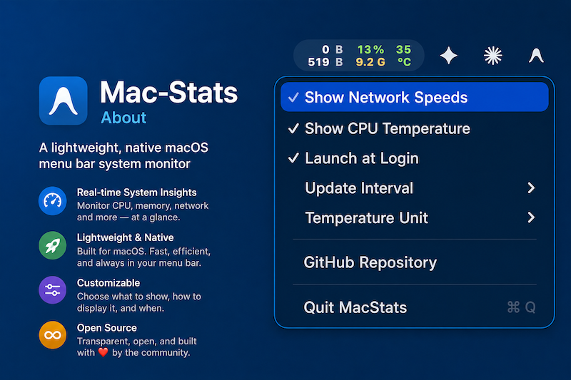

# MacStats 📊

> A lightning-fast, native macOS Menu Bar monitor built with Swift. Keep an eye on your CPU usage, RAM consumption, network speeds, and CPU temperature in real time—right at a glance.

🌐 [English](README.md) | [Tiếng Việt](README.vi.md) | [简体中文](README.zh.md) | [日本語](README.ja.md)




---

## ⚡ Quick Start

### 📦 One-Line Download & Install
Just copy and paste this command into your Terminal. It will automatically download, extract, and install **MacStats** directly into your `/Applications` folder:

```bash
curl -fsSL https://raw.githubusercontent.com/openhoangnc/mac-stats/main/install.sh | bash
```

---

### 🗑️ Complete Uninstallation
Want to remove it completely? This command safely stops the app, removes it from your startup items, clears your user preferences, and deletes the app bundle:

```bash
curl -fsSL https://raw.githubusercontent.com/openhoangnc/mac-stats/main/uninstall.sh | bash
```

---

## ✨ Key Features

- 🚀 **Ultra-Lightweight & Blazing Fast**: Written entirely in native Swift, guaranteeing a minimal memory and CPU footprint. No bloated Xcode projects or heavy third-party dependencies.
- 📊 **Triple-Column Menu Bar Display**:
  - **Left (Network)**: Real-time Upload (top) and Download (bottom) speeds. Units scale automatically (`B`, `K`, `M`, `G`), and colors adapt dynamically to bandwidth usage.
  - **Center (CPU/Memory)**: Live CPU load (`%`, top) and RAM usage (`G`, bottom). Smart color thresholds (Green → Yellow → Red) instantly warn you under heavy load.
  - **Right (Temperature)**: Average CPU temperature (top) and unit (`°C` or `°F`, bottom). Text colors shift dynamically based on heat levels.
- 🔝 **Top Resource Hogs at a Glance**: Opening the menu instantly reveals the apps consuming the most **CPU** and **memory**, ranked in real time. Helper processes (like a browser's many renderers) are rolled up into their parent app, and background system daemons are filtered out—so you only see the apps that actually matter.
- ⚙️ **Quick Settings Menu**: Left or right-click the menu bar icon to access:
  - **Open Activity Monitor**: Jump straight to macOS Activity Monitor for the full, detailed breakdown.
  - **Show Network Speeds**: Toggle the visibility of the network speeds column.
  - **Show CPU Temperature**: Toggle the visibility of the CPU temperature column.
  - **Launch at Login**: Easily toggle automatic startup. (Seamlessly uses macOS 13+ `SMAppService`, with automatic fallbacks to LaunchAgents plist for older systems).
  - **Update Interval**: Customize how often data refreshes (1s, 2s, or 5s).
  - **Temperature Unit**: Switch effortlessly between Celsius and Fahrenheit.
  - **GitHub Repository**: Direct link to the source code.
  - **Quit MacStats**: Safely close the app.
- 🧠 **Dynamic SMC Temperature Scanning**: On startup, it automatically discovers active SMC temperature sensors for both Intel and Apple Silicon (M1/M2/M3/M4/M5) chips—including efficiency cores, performance cores, and general sensors—to calculate a highly accurate real-time average.
- ⚡ **Deep Performance & Memory Optimizations**:
  - Runs entirely as a background accessory (`LSUIElement`). It stays out of your Dock and won't clutter your Command-Tab app switcher.
  - Actively prevents memory fragmentation by calling `malloc_zone_pressure_relief` on startup and every 30 seconds thereafter.
  - Implements a smart 25% timer tolerance, allowing macOS to coalesce background tasks and drastically save battery life.
- 🤖 **Automated CI/CD Workflows**: A built-in GitHub Actions pipeline automatically compiles the `.app`, increments semantic version numbers, and publishes new GitHub Releases.

---

## 🛠️ CLI Flags & Manual Build
The compiled binary natively supports the following command-line flags for silent management:
- `--cleanup-login-item` / `--uninstall-login-item` / `--uninstall`: Silently unregisters `SMAppService` launch items, removes user LaunchAgent plists, flushes user defaults, and immediately exits.

If you prefer to compile it yourself from source:

1. Clone the repository:
   ```bash
   git clone https://github.com/openhoangnc/mac-stats.git
   cd mac-stats
   ```

2. Run the build script:
   ```bash
   ./build.sh
   ```

3. Launch the application:
   ```bash
   open MacStats.app
   ```

---

## 🤖 Continuous Integration & Versioning

The project is fully automated via `.github/workflows/release.yml`.

- **Automatic Version Bumping**: Pushing to the main branch (or triggering manually) automatically bumps the version number (e.g., `v1.0.0` → `v1.0.1`).
- **Automated Releases**: The workflow compiles the native macOS app bundle, compresses it into `MacStats.zip`, and automatically attaches it to a new GitHub Release.

---

## 🧑‍💻 For Developers: Unique Techniques to Learn

This project employs several uncommon and highly optimized techniques for macOS development that you might find interesting:

1. **Zero-Xcode App Bundling**: This app is built entirely without an Xcode project file. Instead, it uses a custom bash script (`build.sh`) that invokes the `swiftc` compiler directly with aggressive size optimizations (`-Osize`, `-wmo`, `-dead_strip`). It then manually constructs the `.app` bundle structure, proving that you can build native macOS UI apps with just a terminal and text editor.
2. **Direct Low-Level C APIs**: To achieve near-zero CPU overhead, the app bypasses high-level `Foundation` wrappers. It directly calls Mach kernel APIs (`host_processor_info`, `host_statistics64`) and BSD socket APIs (`getifaddrs`) from Swift using raw memory pointers.
3. **Zero-Allocation String Parsing**: Inside the network polling loop, instead of allocating a Swift `String` to check if an interface is Ethernet/Wi-Fi (e.g., `name.hasPrefix("en")`), the engine compares raw C-string bytes directly (`namePtr.pointee == 0x65 && namePtr.advanced(by: 1).pointee == 0x6e`). This completely eliminates memory allocation in the high-frequency polling loop.
4. **Dynamic SMC Discovery via IOKit**: Instead of hardcoding temperature sensor keys or using undocumented private frameworks, the app uses IOKit to dynamically probe the System Management Controller (SMC) on startup. It checks a vast array of known Apple Silicon and Intel keys, automatically discovering which ones are active on the host machine.
5. **Active Memory Pressure Relief**: Background apps that run indefinitely often suffer from memory fragmentation. This app actively mitigates this by manually calling low-level memory management functions (like `malloc_zone_pressure_relief`) to aggressively keep the background memory footprint tight.

---

## 📄 License

This project is licensed under the MIT License.
